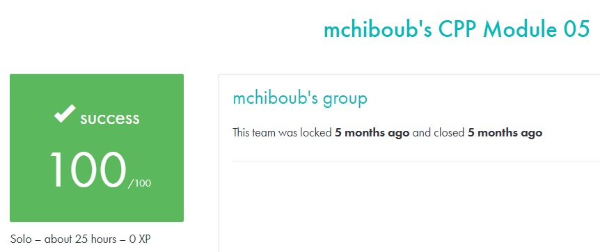

# C++ module 05 #

## What the project does: ##
The C++ - Module 05 project focuses on exceptions and repetition in C++. It requires creating a hierarchy of bureaucrats and forms, handling various exceptions, and automating form creation and execution. This includes implementing abstract classes, custom exceptions, and handling different form types, such as robotomization and presidential pardons.

## Why the project is useful: ##
This project is useful because it teaches how to manage error handling using exceptions and apply abstract classes for flexible code. It improves your understanding of real-world scenarios like authorization and task delegation while honing your C++ skills in class hierarchy, inheritance, and exception management.

[Subject of this project](en.subject.pdf)